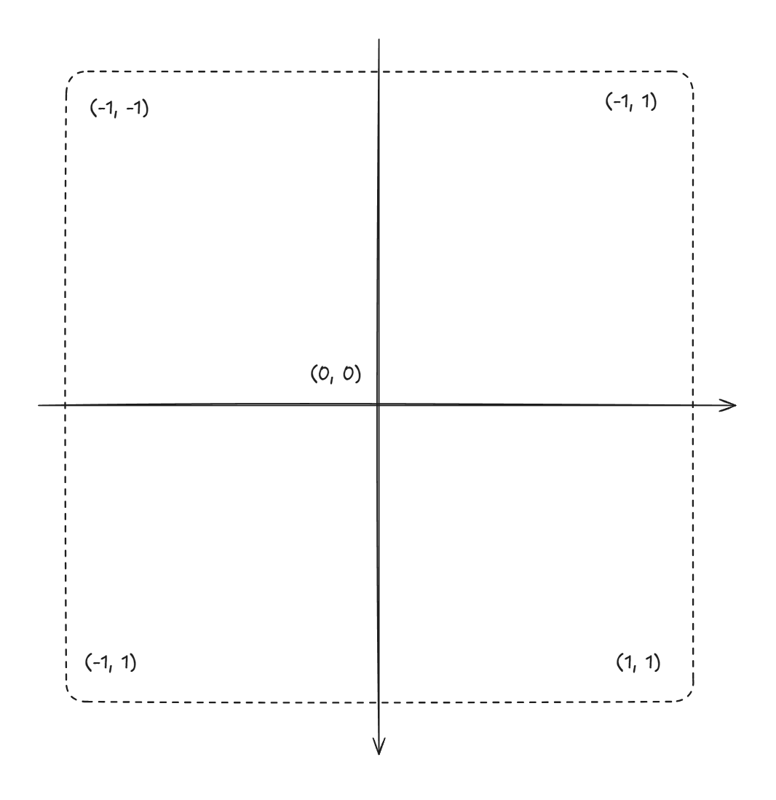

# The Blob

## CircelSDF

```glsl
float circleSDF(vec2 p, float r) {
    return length(p) - r;
}
```

More SDF see this [list](https://iquilezles.org/articles/distfunctions2d/)

## UV Remap
Remap uv from (0, 0) at Top-Left to (0, 0) at Center, also Scale from (0, 1) to (-1, 1)




## Min and Smin
Based on the definition of SDF, the distance from one point to one shape is:
1. Positive outside
2. Negative inside
3. Near 0 when close to Edges

This rules also apply to multiple shapes, we can calculate distances from one point(p0) to all shapes(d0, d1, ... dn) and get:
1. When `min(d0, d1, ... ,dn) > 0`, means p0 is outside of `all shapes`
2. When `min(d0, d1, ... ,dn) < 0`, means p0 is inside of `some shapes`
3. When `min(d0, d1, ... ,dn) = 0`, means p0 is on edge of `some shapes`


As you can see `min operation` is a perfect tool to check relative position from one point to all shapes, and `smooth minimum` can make the transition smoother

## Blob 

This shader demostrate:
1. uv remap
2. circle sdf
1. effects of both `min` and `smin`


