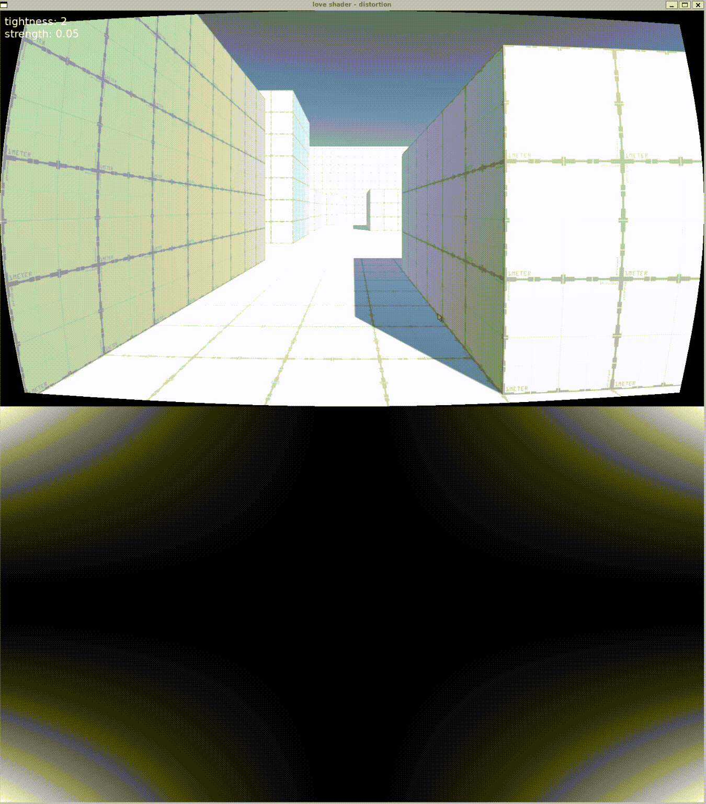

# Distortion

Create distortion based on the distance to the center of the screen.

The distortion magnitude is simple:

```
pow(abs(x * y) * tightness) * strength
```

As you can see, there are two variables that control the distortion
l

