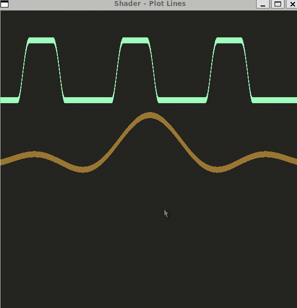

# PlotLine

## Shape Function

To plot line based on `y = f(x)`, we can calculate the diff between `y` and `f(x)`
```
d = f(x) - y
```
For a Point (x, y), if d = y - f(x) = 0, then this point lies exactly on the line represented by `y=f(x)`


## PlotLine

Plot line based on different f(x) or f(x, t)



