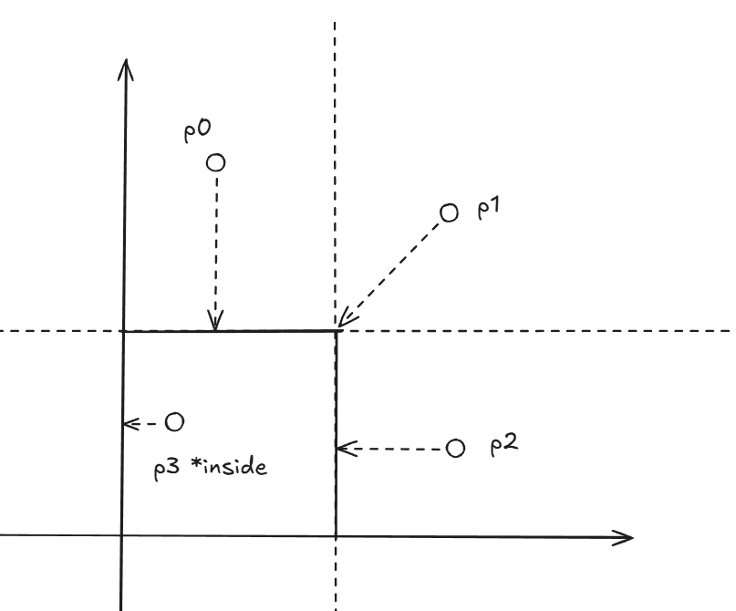
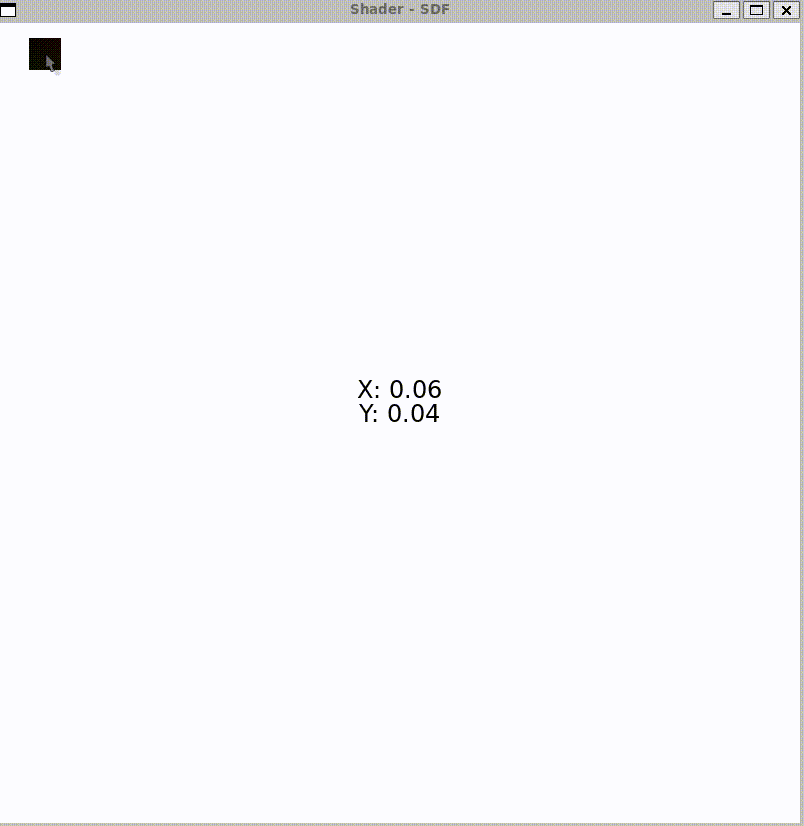

# SDF

Signed Distance Functions(SDF)
* Positive outside
* Negative inside

## BoxSDF



```glsl
float sdBox( in vec2 p, in vec2 b ){
    vec2 d = abs(p)-b;
    return length(max(d,0.0)) + min(max(d.x,d.y),0.0);
}
```

More SDF see this [list](https://iquilezles.org/articles/distfunctions2d/)


## More on SDF and Coordinate

A shader that change (R, G) color based on mouse position



